  

  

<a href="https://lorenzopasquali.dev"><b>lorenzopasquali.dev</b></a>

---

I build and maintain production software end to end, and I research how AI fits into every step of that work: autonomous agent orchestration, multi-agent systems, tool calling, RAG and MCP, mostly with Claude.

Today I work on a shop-floor management system (MES) with more than 20 years of code in production. I take features from the technical analysis to the Java/Spring Boot API and the Angular screen, look after its Dockerized microservices and run its builds and deployments through Jenkins.

## Stack

| Area | Tools |
|---|---|
| **Backend** |      REST APIs · Microservices · ERP, WMS and APS integrations |
| **Frontend** |       |
| **Data** |      Relational modeling · Query optimization |
| **DevOps** |       |

## Contributions

<picture>
  <source media="(prefers-color-scheme: dark)" srcset="https://raw.githubusercontent.com/LorenzoPasquali/LorenzoPasquali/output/snake-dark.svg">
  <source media="(prefers-color-scheme: light)" srcset="https://raw.githubusercontent.com/LorenzoPasquali/LorenzoPasquali/output/snake-light.svg">
  
</picture>

## Contact

[lorenzopasquali.dev](https://lorenzopasquali.dev) · [LinkedIn](https://www.linkedin.com/in/lorenzo-pasquali) · [lorenzoapasquali@gmail.com](mailto:lorenzoapasquali@gmail.com)
